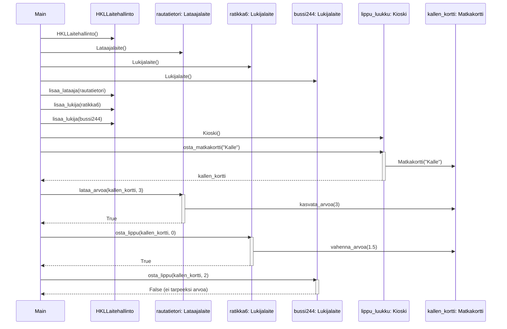

# HSL Sekvenssikaavio

```mermaid
 sequenceDiagram
  participant Main
  participant HKLLaitehallinto
  participant Lataajalaite as rautatietori: Lataajalaite
  participant Lukijalaite as ratikka6: Lukijalaite
  participant Lukijalaite2 as bussi244: Lukijalaite
  participant Kioski as lippu_luukku: Kioski
  participant Matkakortti as kallen_kortti: Matkakortti

  Main->>HKLLaitehallinto: HKLLaitehallinto()
  Main->>Lataajalaite: Lataajalaite()
  Main->>Lukijalaite: Lukijalaite()
  Main->>Lukijalaite2: Lukijalaite()

  Main->>HKLLaitehallinto: lisaa_lataaja(rautatietori)
  Main->>HKLLaitehallinto: lisaa_lukija(ratikka6)
  Main->>HKLLaitehallinto: lisaa_lukija(bussi244)


  Main->>Kioski: Kioski()
  Main->>Kioski: osta_matkakortti("Kalle")
  activate Kioski
  Kioski->>Matkakortti: Matkakortti("Kalle")
  Kioski-->>Main: kallen_kortti
  deactivate Kioski

  Main->>Lataajalaite: lataa_arvoa(kallen_kortti, 3)
  activate Lataajalaite
  Lataajalaite->>Matkakortti: kasvata_arvoa(3)
  Lataajalaite-->>Main: True
  deactivate Lataajalaite

  Main->>Lukijalaite: osta_lippu(kallen_kortti, 0)
  activate Lukijalaite
  Lukijalaite->>Matkakortti: vahenna_arvoa(1.5)
  Lukijalaite-->>Main: True
  deactivate Lukijalaite

  Main->>Lukijalaite2: osta_lippu(kallen_kortti, 2)
  activate Lukijalaite2
  Lukijalaite2-->>Main: False (ei tarpeeksi arvoa)
  deactivate Lukijalaite2
```
