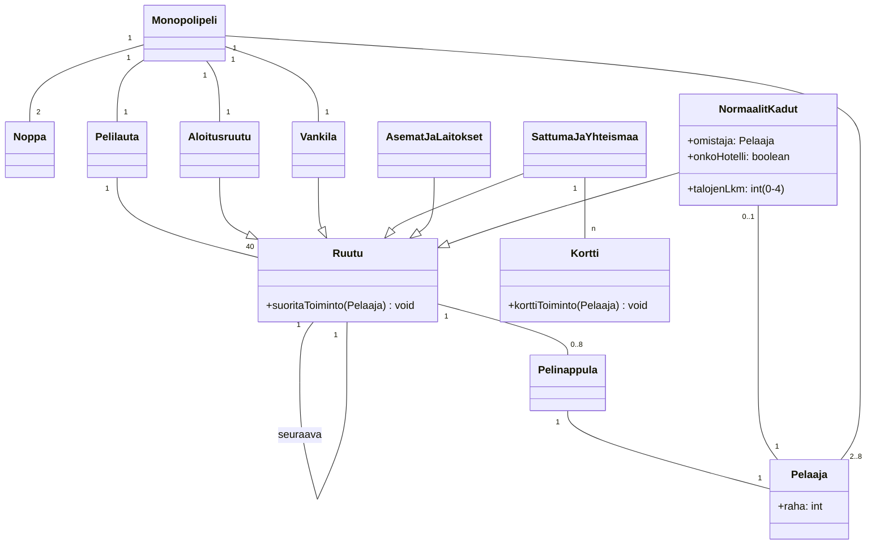

# Monopoli

```mermaid
 classDiagram
    Monopolipeli "1" -- "2" Noppa
    Monopolipeli "1" -- "1" Pelilauta
    Pelilauta "1" -- "40" Ruutu
    Ruutu "1" -- "1" Ruutu : seuraava
    Ruutu "1" -- "0..8" Pelinappula
    Pelinappula "1" -- "1" Pelaaja
    Pelaaja "2..8" -- "1" Monopolipeli
    Monopolipeli "1" -- "1" Aloitusruutu
    Aloitusruutu --|> Ruutu
    Vankila --|> Ruutu
    SattumaJaYhteismaa --|> Ruutu
    AsematJaLaitokset --|> Ruutu
    NormaalitKadut --|> Ruutu
    Monopolipeli "1" -- "1" Vankila
    SattumaJaYhteismaa "1" -- "n" Kortti
    NormaalitKadut "0..1" -- "1" Pelaaja


    class Ruutu {
        +suoritaToiminto(Pelaaja) void
    }

    class NormaalitKadut {
        +omistaja: Pelaaja
        +talojenLkm: int (0-4)
        +onkoHotelli: boolean
    }

    class Pelaaja {
        +raha: int
    }

    class Kortti {
        +korttiToiminto(Pelaaja) void
    }
```
