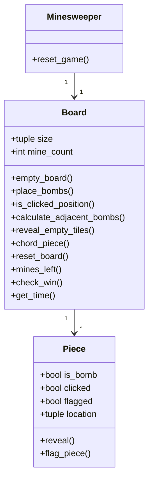

# Arkkitehtuurikuvaus

## Luokkakaavio

```mermaid
classDiagram
    class Minesweeper {
        +reset_game()
    }
    class Board {
        +tuple size
        +int mine_count


        +empty_board()
        +place_bombs()
        +is_clicked_position()
        +calculate_adjacent_bombs()
        +reveal_empty_tiles()
        +chord_piece()
        +reset_board()
        +mines_left()
        +check_win()
        +get_time()
    }

    class Piece {
        +bool is_bomb
        +bool clicked
        +bool flagged
        +tuple location

        +reveal()
        +flag_piece()
    }

    Minesweeper "1" --> "1" Board
    Board "1" --> "*" Piece
```
