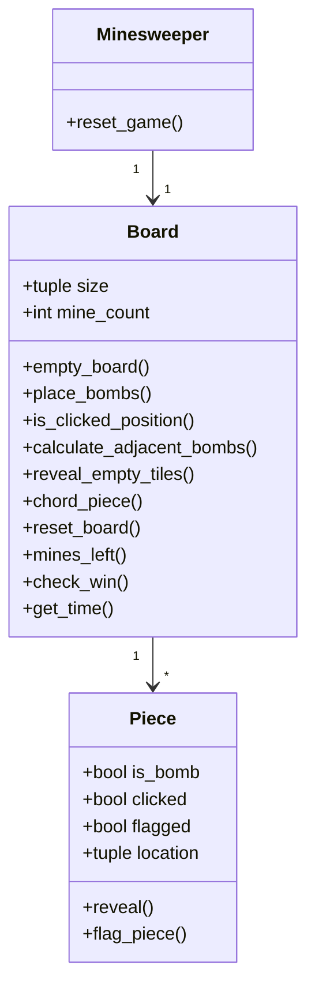
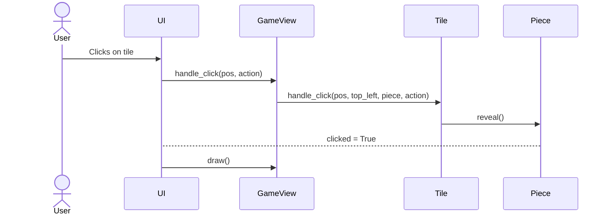
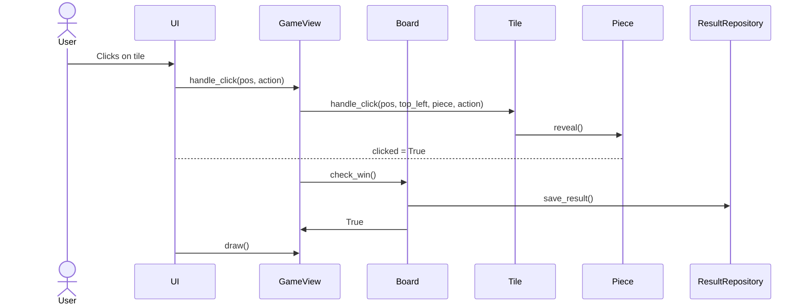

# Arkkitehtuurikuvaus

## Rakenne

Koodin pakkausrakenne on seuraava:

Pakaus *ui* sisältää käyttöliittymän, *logic* joka sisältää pelilogiikan.
services-pakkaus sisältää pelin tallennukseen liittyvän logiikan ja *repositories* tietojen pysyväistallennukseen vastaavan koodin.
*entities*-pakkaus sisältää tyypit, joita käytetään pelin sisällä.

## Käyttöliittymä

Käyttöliittymä sisältää kolme näkymää:

- Valikkonäkymä, jossa valitaan vaikeustaso
- Pelinäkymä, jossa pelataan peliä
- Tilastot-näkymä, jossa näytetään pelin tilastot

Jokainen näistä toteutettu omana, erillisenä luokkana ja käyttöliittymä on totetettu Pygame-kirjastolla. Käyttöliittymä on yritetty eristää pelilogiikasta.

## Sovelluslogiikka

Yksinkertaistettu luokkakaavio pelilogiikasta on esitetty alla. Pelilogiikka on toteutettu luokassa `Minesweeper`, joka käyttää `Board`-luokkaa pelilaudan hallintaan ja `Piece`-luokkaa yksittäisten ruutujen hallintaan.

## Tietojen pysyväistallennus

Pakkauksen *repositories* sisältää luokan `ResultRepository` joka vastaa pelin tilastojen tallentamisesta ja lataamisesta. Se käyttää SQLite-tietokantaa tietojen pysyväistallennukseen.

## Päätoiminnallisuudet

Kuvataan seuraavaksi muutama päätoiminnallisuus sekvenssikaaviona.

### Käyttäjä klikkaa ruutua pelilaudalla

### Käyttäjä paljastaa viimeisen tyhjän ruudun, jolloin peli päättyy voittoon

## Github Actions

Projektissa käytetään *GitHub Actions* -automaatiota koodin laadun varmistamiseen. [`format.yml`](https://github.com/erikpeik/ot-harjoitustyo/blob/main/.github/workflows/format.yml) suorittaa automaattisesti *autopep8*-tarkistuksen. [`pylint.yml`](https://github.com/erikpeik/ot-harjoitustyo/blob/main/.github/workflows/pylint.yml) ajaa Pylint-analyysin koodin laadun ja virheiden tunnistamiseksi.

Työnkulut on määritelty `.github/workflows`-kansiossa. Työnkulut suoritetaan automaattisesti jokaisen commitin yhteydessä ja ne voidaan tarkistaa GitHubin käyttöliittymässä [Actions-välilehdeltä](https://github.com/erikpeik/ot-harjoitustyo/actions)
