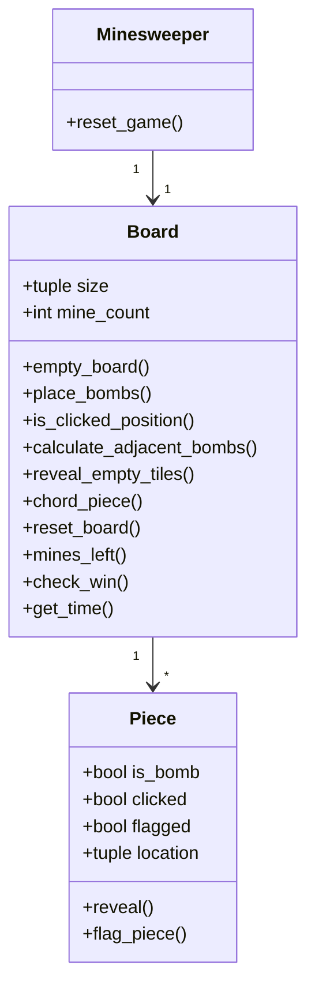
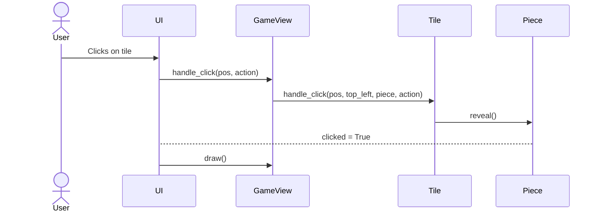

# Arkkitehtuurikuvaus

## Rakenne

Koodin pakkausrakenne on seuraava:

Pakaus *ui* sisältää käyttöliittymän, *logic* joka sisältää pelilogiikan.
services-pakkaus sisältää pelin tallennukseen liittyvän logiikan ja *repositories* tietojen pysyväistallennukseen vastaavan koodin.
*entities*-pakkaus sisältää tyypit, joita käytetään pelin sisällä.

## Käyttöliittymä

Käyttöliittymä sisältää kolme näkymää:

- Valikkonäkymä, jossa valitaan vaikeustaso
- Pelinäkymä, jossa pelataan peliä
- Tilastot-näkymä, jossa näytetään pelin tilastot

## Luokkakaavio

## Tietojen pysyväistallennus

Pakkauksen *repositories* sisältää luokan `ResultRepository` joka vastaa pelin tilastojen tallentamisesta ja lataamisesta. Se käyttää SQLite-tietokantaa tietojen pysyväistallennukseen.

## Päätoiminnallisuudet

Kuvataan seuraavaksi muutama päätoiminnallisuus sekvenssikaaviona.

### Käyttäjä klikkaa ruutua pelilaudalla

