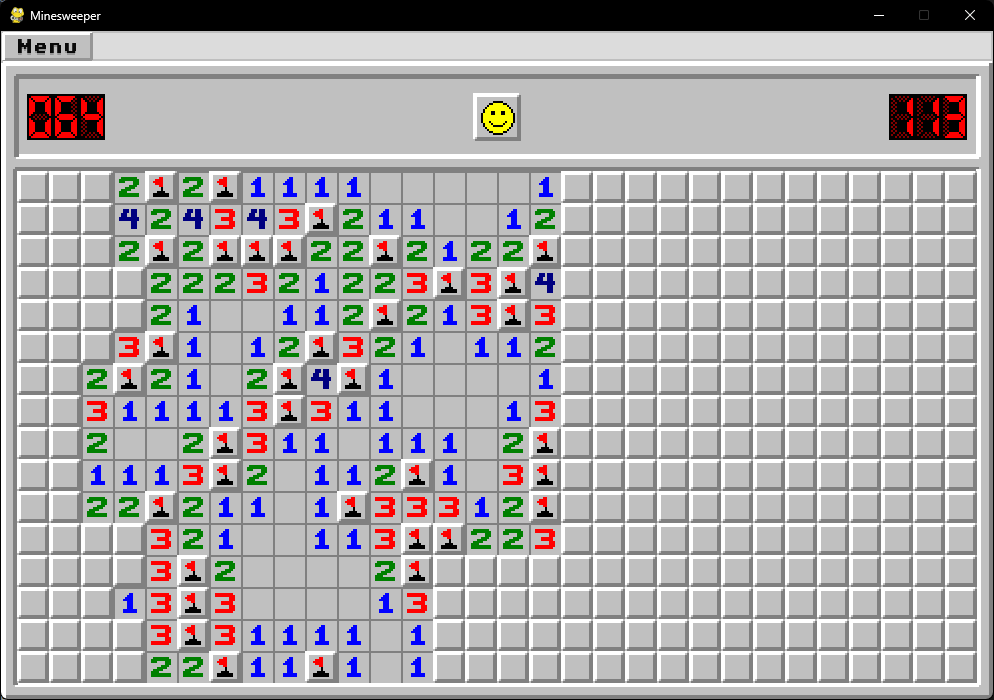

# Käyttöohje

Lataa projektin viimeisin [release-version](https://github.com/erikpeik/ot-harjoitustyo/releases) lähdekoodi.

Ohjelma on toteutettu Python 3.10:llä, joten varmista, että sinulla on se asennettuna. Ohjelma käyttää myös [Poetry](https://python-poetry.org/) -työkalua riippuvuuksien hallintaan ja projektin rakentamiseen.

Ohjelma tukee ainakin Windows ja Linux käyttöjärjestelmiä. Ohjelma on testattu Windows 11 ja Yliopiston Cubli -linux ympäristössä.

## Ohjelman asennus ja käynnistys

Siirrytään alikansioon:

```bash
ot-harjoitustyo/minesweeper
```

Asennetaan riippuvuudet komennolla:

```bash
poetry install
```

Jonka jälkeen suorita alustustoimeenpiteet kommolla:

```bash
poetry run invoke build
```

Nyt ohjelma on valmis ajettavaksi seuraavalla komennolla:

```bash
poetry run invoke start
```

## Valikkonäkymä

Sovellus kännistyy valikkonäkymästä, jossa käyttäjä voi valita pelin vaikeustason tai mennä katsomaan tulosruutua.

### Valittavissa on kolme vaihtoehtoa

- Helppo (9x9, 10 miinaa)
- Keskivaikea (16x16, 40 miinaa)
- Vaikea (30x16, 99 miinaa)


## Pelinäkymä

Pelinäkymässä pelaaja voi pelata peliä. Pelissä on käytössä seuraavat toiminnot:

- Vasemmalla klikkauksella kun klikkaat ruutua se paljastaa ruudun. Jos ruudussa on miina, peli päättyy.
- Oikealla klikkauksella voi merkitä ruudun miinaksi.
- Vasemman ja oikean klikkausken yhtäaikainen klikkaus avaa kaikki ruuden ympärillä olevat ruudut, jos ympärillä liputettujen ruutujen määrä vastaa valitun ruudun numeroa.
- Hymiö-nappi, jonka klikkaamalla voi aloittaa pelin alusta.

Vasemalla yläreunassa näkyy jäljellä olevien miinojen määrä ja oikealla puolella aika, joka on kulunut pelissä.



## Tulosnäkymä

Tulosnäkymässä näkyy pelaajan pelitilastot. Tulosnäkymässä näkyy voittoprosentti, pelien määrä, voittettujen ja hävityjen pelien määrä.

Tulosnäkymässä näkyy myös kolme nopeinta peliä, jotka on pelattu jokaisella vaikeusasteella.


