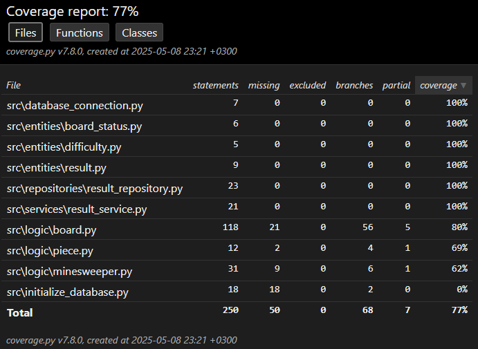

# Testausdokumentaatio

Yksikkö- ja integraatiotestauksessa on käytetty Pythonin unittest-kirjastoa. Testattu myös järjestelmätasolla manuaalisesti.

## Yksikkö- ja integraatiotestaus

### Sovelluslogiikan testaus

Sovelluslogiikka sijaitsee `/logic`-kansiossa olevista Luokista.
Myös `ResultService`-luokka on testattu, joka vastaa pelin tilastojen tallentamisesta ja lataamisesta. Käytössä `FakeResultRepository`-luokka, joka toimii testidatan tallentajana ja lataajana.

### Repositorio-tason testaus

Repositorio-tason luokka `ResultRepository` on testattu erikseen. Se käyttää SQLite-tietokantaa tietojen pysyväistallennukseen.

### Testauskattavuus

## Järjestelmätestaus

Sovellu järjestelmätestaus on suoritettu manuaalisesti.

### Asennus

Sovellus on ladattu ja testattu [käyttöohjeen](./kayttoohje.md) mukaisesti sekä Windows- että Linux-käyttöjärjestelmissä.

### Toiminnallisuuksien testaus

Kaikki [määritellyt toiminnallisuudet](./vaatimusmaarittely.md) on testattu ja käyty läpi manuaalisesti.
